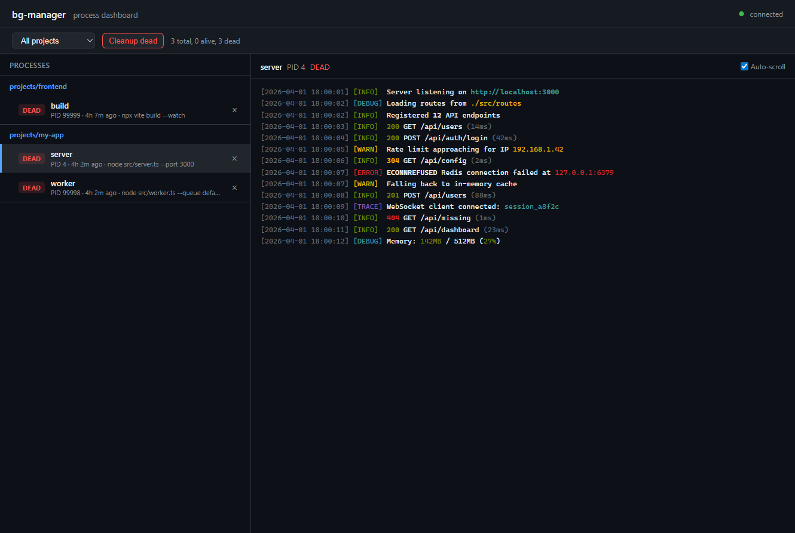

# claude-code-bg-process-manager

MCP server for managing background processes in [Claude Code](https://claude.ai/code) on Windows.



## Why This Exists

Claude Code on Windows (Git Bash / MSYS2) has a fundamental process management problem. Without this tool, Claude Code will repeatedly:

1. **Forget PIDs** — starts a background process, loses the PID, then can't kill it later
2. **Try `taskkill`** — which MSYS/Git Bash flag-mangles (`/T /F /PID` become Unix paths), failing every time
3. **Try bash `kill`** — which operates on MSYS PIDs, not Windows PIDs, silently doing nothing
4. **Blanket-kill by process name** — desperate, it runs `taskkill /IM node.exe /F` or equivalent, killing ALL node processes including itself, other dev servers, and unrelated tools
5. **Try `Get-NetTCPConnection`** — which hangs indefinitely on many Windows configurations
6. **Lose output** — `run_in_background` and `&` don't capture logs, so when something fails there's no way to diagnose it

This is not a one-time issue — **Claude Code re-discovers these failures every session** because it has no persistent memory of what works on Windows. Even with `CLAUDE.md` instructions saying "use PowerShell Stop-Process", Claude Code still needs to compose the right invocation, track PIDs manually, and handle edge cases like process trees and shell wrappers.

### What this MCP server provides

- **SQLite database** — all process metadata stored in `~/.bg-manager/bg-manager.db` (WAL mode), shared across all projects
- **Web dashboard** — live process monitoring at `http://127.0.0.1:7890` with ANSI color log rendering, SSE live updates, and kill/cleanup actions
- **Automatic PID tracking** — every `bg_run` records the PID, command, intent, and timestamp
- **Reliable process killing** — `bg_kill` uses PowerShell `Stop-Process` with recursive tree kill (children first, then parent). Never `taskkill`, never bash `kill`
- **Log capture with colors** — all stdout/stderr goes to `~/.bg-manager/logs/`, with `FORCE_COLOR=1` to preserve ANSI colors
- **Port management** — `bg_port_check` uses `netstat -ano` (the only reliable method on Windows), correlates PIDs with tracked processes by walking the parent chain
- **Cross-project visibility** — all projects share one central database, viewable in the web dashboard
- **Smart spawning** — simple commands spawn directly (PID = actual process), complex commands (pipes, `&&`) spawn via Git Bash with proper wrapper tracking
- **Python-friendly** — automatically sets `PYTHONUNBUFFERED=1` and `PYTHONIOENCODING=utf-8`

## Tools

| Tool | Description |
|------|-------------|
| `bg_run(name, command, intent)` | Start a background process with auto-logging and PID tracking |
| `bg_list()` | List all tracked processes with alive/dead status |
| `bg_kill(name)` | Kill a tracked process by name (full process tree) |
| `bg_logs(name, lines?)` | Read last N lines from a process log |
| `bg_port_check(port)` | Check what's listening on a port (with tracked process correlation) |
| `bg_port_kill(port)` | Kill whatever is listening on a port |
| `bg_cleanup()` | Remove dead entries from registry |
| `bg_status()` | Show dashboard URL, database path, and project info |

## Install

One command — installs directly from GitHub, no npm publish needed:

```bash
# Windows (global, all projects)
claude mcp add -s user bg-manager -- cmd /c npx -y github:AndrewKirkovski/claude-code-bg-process-manager-windows

# Linux/macOS (global, all projects)
claude mcp add -s user bg-manager -- npx -y github:AndrewKirkovski/claude-code-bg-process-manager-windows
```

For per-project only (creates `.mcp.json` in current directory):

```bash
# Windows
claude mcp add bg-manager -- cmd /c npx -y github:AndrewKirkovski/claude-code-bg-process-manager-windows

# Linux/macOS
claude mcp add bg-manager -- npx -y github:AndrewKirkovski/claude-code-bg-process-manager-windows
```

### From source (local development)

```bash
git clone git@github.com:AndrewKirkovski/claude-code-bg-process-manager-windows.git
cd claude-code-bg-process-manager-windows
npm install && npm run build

# Then add to Claude Code pointing to local build:
claude mcp add -s user bg-manager node /path/to/claude-code-bg-process-manager-windows/dist/index.js
```

## Storage

- **Database:** `~/.bg-manager/bg-manager.db` (SQLite, WAL mode)
- **Logs:** `~/.bg-manager/logs/<project-slug>-<name>.log`
- **Web UI:** `http://127.0.0.1:7890` (auto-increments if port is taken)

All data is centralized in `~/.bg-manager/` — shared across all projects. Legacy `.local/bg-processes.json` registries are automatically migrated on first run.

## Web Dashboard

The built-in web dashboard at `http://127.0.0.1:7890` provides:

- **Live process list** grouped by project with ALIVE/DEAD status badges
- **ANSI color log viewer** — terminal colors rendered in the browser
- **SSE live updates** — process status and log streaming update in real-time
- **Kill/cleanup actions** — manage processes directly from the browser
- **Project filter** — focus on a specific project's processes

The dashboard starts automatically when the MCP server launches. Use `bg_status` to get the actual URL (port may increment if 7890 is taken).

## CLAUDE.md Integration

Add the following to your project's `CLAUDE.md` (or global `~/.claude/CLAUDE.md`) to ensure Claude Code always uses bg-manager instead of raw bash:

```markdown
## Process Management — MANDATORY
- **ALWAYS use `bg-manager` MCP tools** (`bg_run`, `bg_list`, `bg_kill`, `bg_logs`) for ALL background processes. NEVER use bash `&` or `run_in_background` directly.
- `bg_run` automatically: captures PID, logs stdout/stderr to `~/.bg-manager/logs/`, tracks metadata (intent, command, start time)
- `bg_list` shows all tracked processes with alive/dead status — check what's running
- `bg_kill <name>` kills by exact PID from registry — never kills unrelated processes
- `bg_logs <name>` reads the log tail — use instead of `tail -f` on unknown files
- **BEFORE starting ANY server/process**: run `bg_list` to check what's already running. `bg_kill` old one first.
- **BEFORE editing server code**: `bg_list`, `bg_kill` the server, then edit, rebuild, `bg_run`
- NEVER blanket-kill by process name — always by exact name via `bg_kill`
- NEVER use bash `&` directly — use `bg_run` instead
```

This is important because without these instructions, Claude Code will default to its built-in `run_in_background` which loses PID tracking and makes process management unreliable on Windows.

## Sample Claude Code Hooks

Hooks are shell commands that Claude Code runs automatically in response to events. Add these to your `~/.claude/settings.json` or project `.claude/settings.json`:

### Auto-cleanup dead processes on session start

```json
{
  "hooks": {
    "SessionStart": [
      {
        "matcher": "",
        "hooks": [
          {
            "type": "command",
            "command": "node -e \"const{existsSync,readFileSync,writeFileSync}=require('fs');const f='.local/bg-processes.json';if(existsSync(f)){const r=JSON.parse(readFileSync(f,'utf-8')).filter(e=>{try{process.kill(e.pid,0);return true}catch{return false}});writeFileSync(f,JSON.stringify(r,null,2))}\"",
            "timeout": 5000
          }
        ]
      }
    ]
  }
}
```

### Warn if a server is already running before starting a new one

```json
{
  "hooks": {
    "PreToolUse": [
      {
        "matcher": "mcp__bg-manager__bg_run",
        "hooks": [
          {
            "type": "command",
            "command": "node -e \"const{existsSync,readFileSync}=require('fs');const f='.local/bg-processes.json';if(existsSync(f)){const alive=JSON.parse(readFileSync(f,'utf-8')).filter(e=>{try{process.kill(e.pid,0);return true}catch{return false}});if(alive.length>0){console.log('WARNING: '+alive.length+' process(es) still running: '+alive.map(e=>e.name).join(', '))}}\"",
            "timeout": 5000
          }
        ]
      }
    ]
  }
}
```

### Log all bg_run invocations

```json
{
  "hooks": {
    "PostToolUse": [
      {
        "matcher": "mcp__bg-manager__bg_run",
        "hooks": [
          {
            "type": "command",
            "command": "echo \"[$(date +%H:%M:%S)] bg_run invoked\" >> .local/bg-audit.log",
            "timeout": 3000
          }
        ]
      }
    ]
  }
}
```

## How It Works

### Process spawning
- Simple commands (no pipes/redirects) are spawned directly — PID is the actual process
- Complex commands (with `&&`, `|`, `;`, etc.) spawn via Git Bash — PID is the bash wrapper
- All output (stdout + stderr) is redirected to `~/.bg-manager/logs/<project-slug>-<name>.log`
- Python processes get `PYTHONUNBUFFERED=1` and `PYTHONIOENCODING=utf-8` automatically
- `FORCE_COLOR=1` is set to preserve ANSI color codes in log output

### Process killing (Windows)
- Uses PowerShell `Stop-Process` with recursive tree kill — kills children first, then parent
- Never uses `taskkill` (MSYS flag mangling) or bash `kill` (wrong PID namespace)
- Port-based kill walks the parent PID chain to find tracked ancestors

### Port checking
- Uses `netstat -ano` — the only reliable method on Windows
- Never uses `Get-NetTCPConnection` (hangs on some configs)
- Correlates port PIDs with tracked processes by walking parent chain

### Architecture

```
MCP Client (Claude) <--stdio--> bg-manager <--HTTP:7890--> Web Browser
                                    |
                                    v
                           ~/.bg-manager/
                             bg-manager.db   (SQLite, WAL mode)
                             logs/           (per-process log files)
```

## License

MIT
